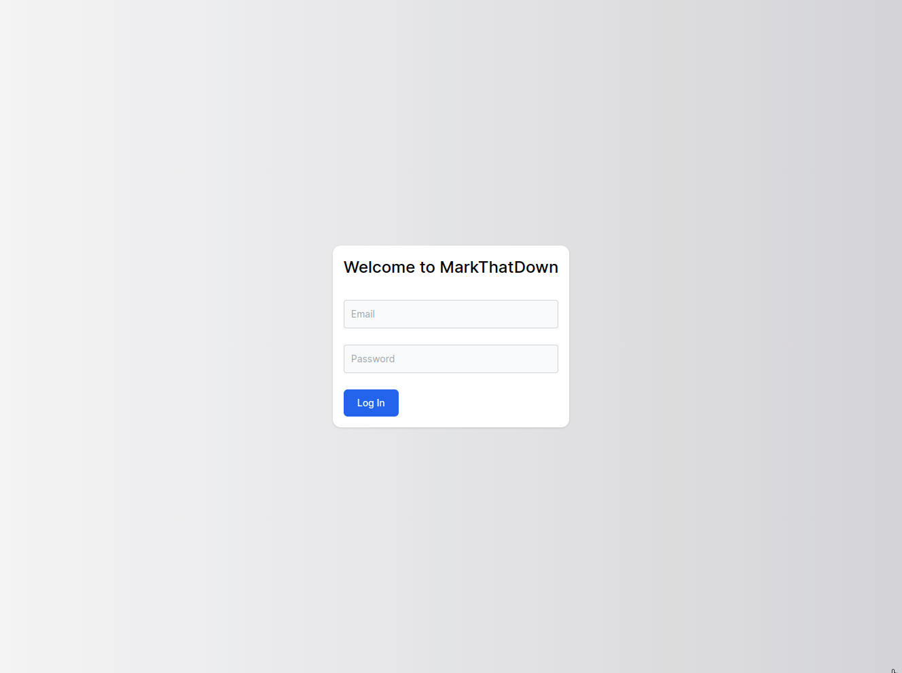

# Drifts

Drifts is a note-taking app for organizing and taking notes in the markdown format.

This is a learning project for the purposes of practising and showcasing PERN stack skills.

First built as a graduation project at the Lighthouse Labs bootcamp, together with [Clifford Tse](https://github.com/TseClifford) and [Alparslan Bahadir Usta](https://github.com/alparslanustaa).

Project forked on April 2022.

## Features

Current highlighted features:

- Live markdown preview with styled CSS
- Minimal responsive design with accessibility features
- CRUD operations for notebooks and notes

Feature wishlist:

- Notebook nesting
- Sorting operations and search functionality for notes
- Web socket connection to auto-save notes as you write (à la Google Docs)
- Share-able links for each note with permissions control

## Screenshots

### Desktop

### Mobile

## Setup

### Backend - Running Express Server

1. Enter backend subdirectory `cd backend`
2. Create `.env` based on `.env.example` with database credentials
3. Install dependencies with `npm install`.
4. Reset database schema and seed data with `npm run db:reset`
5. Start server `npm start`

### Frontend - Running React Client

1. Enter frontend subdirectory `cd frontend`
2. Install dependencies with `npm install`.
3. Start client `npm start`

## Dependencies

- Node 14.x or above
- NPM 5.x or above

#### Back-end

- chalk@2.4.2
- cors@2.8.5
- dotenv@2.0.0
- express@4.17.3
- morgan@1.10.0
- nodemon@2.0.15
- pg@8.7.3

#### Front-end

- @headlessui/react@1.5.0
- @heroicons/react@1.0.6
- @tailwindcss/typography@0.5.2
- @testing-library/jest-dom@5.16.2
- @testing-library/react@12.1.4
- @testing-library/user-event@13.5.0
- axios@0.26.1
- js-cookie@3.0.1
- react-dom@17.0.2
- react-markdown@8.0.1
- react-scripts@5.0.0
- react@17.0.2
- remark-gfm@3.0.1
- web-vitals@2.1.4
